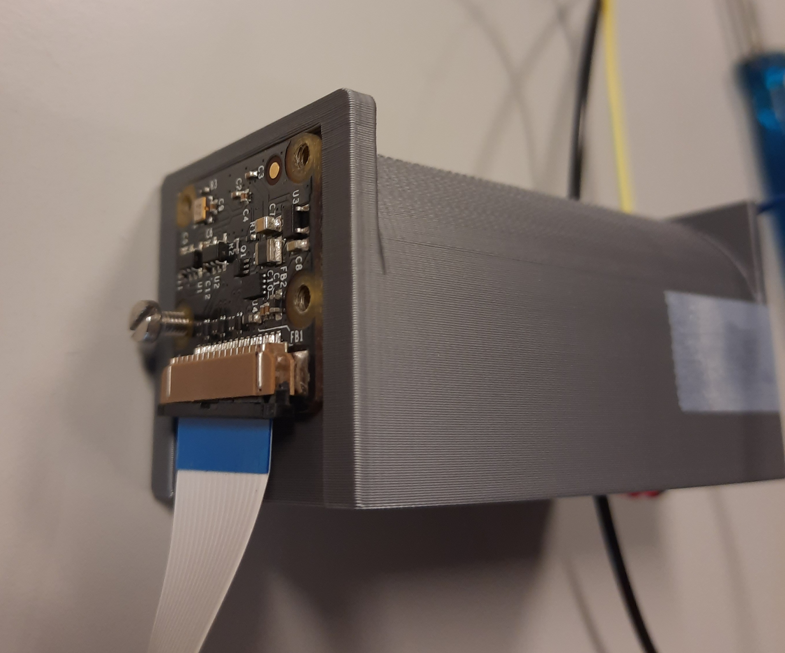
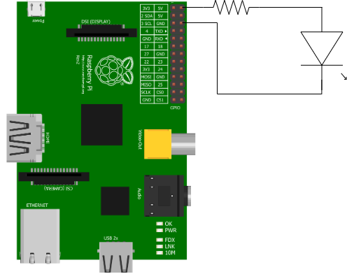
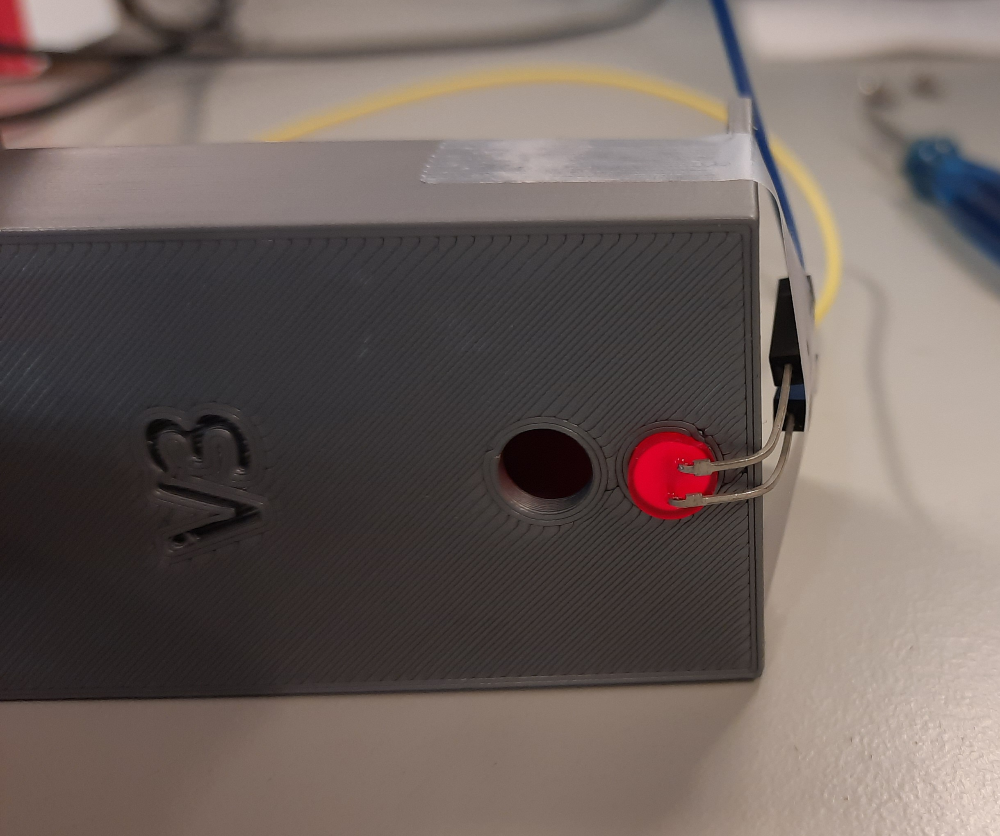

# **Assembling the Device** 
## **Parts list:**
+ [Raspberry Pi 3 Model B](https://www.raspberrypi.com/products/raspberry-pi-3-model-b/)
+ [Raspbery Pi NoIR Camera V2](https://www.raspberrypi.com/products/pi-noir-camera-v2/)
+ Red LED, 5 mm diameter
+ Resistor, 150 Ohm
+ Female-female cables (x3)
+ [3D-printed casing](../../Hardware/stl_files/filament_observer_v2_chamfer.stl).
+ [3D-printed Raspberry Pi mount](../Hardware/SLT_Files/RPi%20Base%20V1.stl) (optional to mount on Raspberry Pi)
+ HDMI cable
+ Ethernet cable
+ Keyboard, mouse, and monitor (for interfacing)
+ USB-micro cable (power supply)
+ M2.5 mm screws (x4)
+ M2.6 mm screws (x4)(optional to mount on Raspberry Pi)

## **Hardware Assembly:** 
+ Take the M2.5 mm screws and mount the camera on to the 3D-printed casing
  + 
+ [Connect the camera into the Raspberry Pi](https://www.techcoil.com/blog/connect-raspberry-pi-camera-module-raspberry-pi-2-raspberry-pi-3/). :warning: If you connect it while the RaspberryPi is running, the camera will break down. **Always make sure that the camera is connected to the RasPi before powering it**. :warning:
+ Connect the LED and the resistor via a female-female cable (make sure you use the longer leg of the LED). Then connect the other legs of the resistor and the LED to the Raspberry Pi as shown below:

  
  **Note:** The LED and the resistor determine the brightness inside the 3D-printed casing. It is important to use the exact materials since the software is tuned accordingly. If you wish to use different materials, you would need to change some parameters in the code for it to recognize the filament. See the [summary of working principles](../../Software/working_principles_summary.md) for more information. 
+ Insert the LED in the 5 mm hole of the 3D-printed casing. 
  + 
+ Connect the Raspberry Pi to: 
  + the mouse and keyboard through USB ports,
  + the monitor with an HDMI cable,
  + the internet through an ethernet cable.  
  
  See the overview [image](../README.md) again, if you wish to check where the ports are on the Raspberry Pi.
+ :warning: Make sure again that the camera is connected to the Raspberry Pi :warning:.
+ Connect the power cord to the RaspberryPi. You will see a red light at the corner of the RasPi, indicating that it is powered on. The LED should also turn on at this point, if it is set up properly.

## **Software Installation:**

Once you manage to access and control the RaspberryPi through the monitor, you should follow these steps to install the required software into the RaspberryPi. If you have already done this, locate [here](measurement_instructions.md) to find the instructions to make measurements.

+ [Install the operating system](https://raspberrytips.com/install-raspbian-raspberry-pi/)
+ [Initialize the camera](https://projects.raspberrypi.org/en/projects/getting-started-with-picamera)
+ Check that the camera is connected by running the command:
  + `vcgencmd get_camera` 
  + This should give the output:
  + `supported = 1, connected = 1` 
+ Install `git` by running the commands
  + `sudo apt-get update`
  + `sudo apt-get install git`
+ Check if Python is installed by running the command
  + `python --version`
+ The version used in this project is 3.9.2. If you do not have is installed, [install it](https://handtoolsforfun.com/how-to-install-python-3-on-a-raspberry-pi-3/).
+ Clone the project repository with `git clone https://git.science.uu.nl/ued2022/ued2022.git`
+ Locate to the folder by using `cd ../ued2022/projects/Filamentals_Ana_Yoldas_Zach/Software/code` and run the command  `pip install -r requirements.txt` to install the libraries required for the code. 

**Next:** The system is ready to insert the filament and [make measurements](measurement_instructions.md! 
