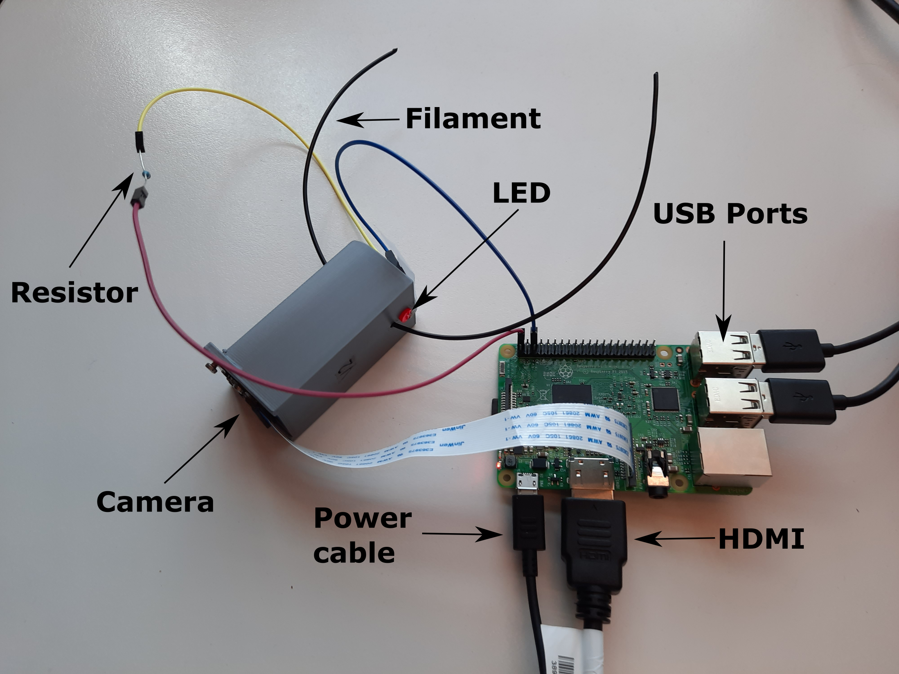

# Welcome to Filamentals!

### **Motivation:** 

FilaMentals is a project to develop an optical device to monitor the diameter of 3D-printer filaments that are produced by an extractor. Custom made extractors are susceptible to produce inhomogenous filaments which would not be useful for re-use in a 3D printer. So, the future aspiration of the project is to create a feedback loop between a FilaMental device and a filament extractor, such that the extractor parameters are automatically adjusted based on the FilaMental output and the desired filament diameter is achieved.  

### **Project Description:**

 A Raspberry Pi NoIR Camera (V2) is controlled by a Raspberry Pi 3 to monitor the filament. The camera and the filament are attached to a 3D-printed casing. The casing also involves a hole for a LED, which illuminates the filament. Later, the images of the filament are analyzed with the help of [OpenCV](https://opencv.org/) package to calculate the thickness. 

### **Build Status:** 

Currently, the project is at a prototpye phase. Data can be collected from filaments, although it cannot be attached to a extruder yet. The code is being optimized to execute faster and provide a better user interface.

### **Prototype image:**

The device has two parts: RaspberryPi (RasPi) and the imaging module. The former operates the device, while the latter contains the camera, filament hole, an LED and a resistor.

### **Installation:** 

For instructions to how to assemble the device click [here](Documentation/instructions/Installation.md).

### **Measurements:**

Currently this project gives live read-outs of filaments up to 5 mm of thickness. 

### **How to use:**

For the instructions of how to run the device click [here](Documentation/instructions/measurement_instructions.md)

### **Developers:**
     Ana Martins: @anaismartins
     Yoldas Cinemre: @YoldasCinemre
     Zach Meredith: @meredizp

### **License:**
For the license see [here](LICENSE).
