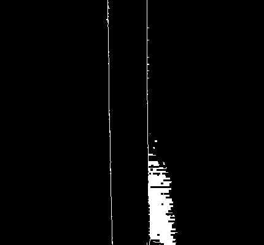

Here is a brief explanation of how the algorithm to analyze the images works.

First the camera takes a picture:

Then it is cropped in the middle for analysis. This needed to ensure that the diameter is mostly consistent throughout the image and that it does not see the visual noise from the set-up: 

Later the code detects the edges in the image (see [here](code/edge_detection.py) for the code):

Then the edges of the filament are recognized as lines with the `HoughLines()` method (see [here](code/line_detection.py)). The code later seperates the image in the middle to classify the pixels belonging to each lines. Hence, it is important that the filament sits symmetrically in the middle of the image. Superimposed on the original image we can see the recognized lines (shown in blue):

Finally the thickness is [calculated](code/distance_calculator.py) by taking the distance between points on the lines and averaging them. The final results are then exhibited on the interface.

**Note:** The code for the edge detection is tuned for the spesific brightness provided by the LED in the current design. If the equipment is altered, so should the code. By changing the `min_threshold` and `max_threshold` values in the [code](code/main.py), the user should find the optimal value for their set up such that the majority of the noise is filtered out and the filament edges can be detected.
